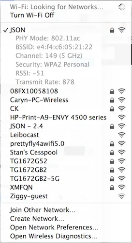
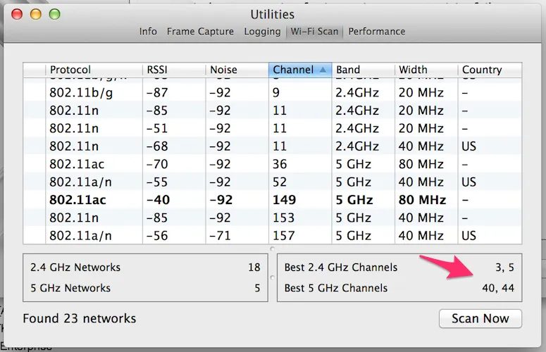

I live in a big apartment building in New York City. Unlike the suburbs, where there would only be one or two wireless networks visible from my bedroom, in my apartment there are roughly _seventy-five billion_. When I set up my WiFi router initially, I changed the network name and password and thought I set up my network correctly. But after a certain amount of time my network got ridiculously slow. What happened?

WiFi network signals go out over various channels. If you and a neighbor are on the same channel your WiFi speed will become slower as a result. So how can you figure out what channels your neighbors are using so you can change yours?

If you're on a Mac, press the “Alt” button and click the “WiFi” icon in the system tray. In the drop down, you should see an option “Open Wireless Diagnostics.”

_The view of the WiFi system tray button while pressing 'Alt'_

In the “Wireless Diagnostics” window, move your cursor to the menu bar and select “Windows -> Utilities”. Go to the “WiFi Scan” tab and click “Scan Now”. You will see a list of all the WiFi networks in range of your computer. Click the column header for “Channel” to order all the networks by channel numbers. Now just find a 2.4Ghz network that is not on channel 1-11. Change your 2.4Ghz channel to that. If you are lucky enough to have a 5Ghz router (if you don’t, get one. There is a lot less interference on that frequency) find a network not on one of the following channels: 36, 40, 44, 48, 149, 153, 157, 161. The WiFi scanner will make a recommendation for you, however for higher performance choose a channel between 149-161.

_Wireless Diagnostics’ WiFi Scan Tab showing ideal wireless channels_

Since changing the channels of my router my internet has been so much faster. All is right in the world.
