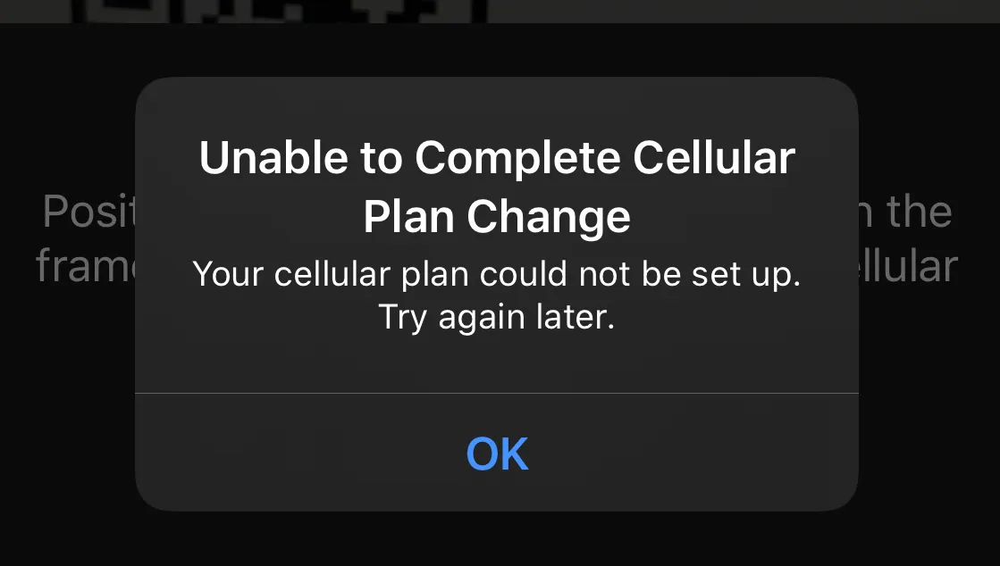

Last year’s iPhone Xs models were the first to support dual-SIM technology, via eSIM. For every previous iPhone upgrade, transferring my number was extremely easy — just put your old SIM card in your new phone. However, since my iPhone Xs’s primary Verizon line was an eSIM, switching was a _major_ pain.

Setting up your new phone from an iCloud Backup or even through phone to phone transfer _does not_ transfer your eSIM as well. You are going to have to contact Verizon Customer Service and have them send you a new QR Code to activate the eSIM on your new phone. This is not at all a straightforward procedure, and unfortunately most Verizon customer services reps have no idea how to do this. Many people are experiencing these same issues…

<blockquote class="twitter-tweet">
  

    <a href="https://twitter.com/Verizon?ref_src=twsrc%5Etfw">@verizon</a>{' '}
    currently on hold going on 38 minutes.. all I need is my phone number
    assigned to my new esim.. can someone help?
  

  &mdash; IDrive32819 (@IDrive32819){' '}
  <a href="https://twitter.com/IDrive32819/status/1175216957890711553?ref_src=twsrc%5Etfw">
    September 21, 2019
  </a>
</blockquote>

<blockquote class="twitter-tweet">
  

    Ridiculous that you need an agent to help you swap Verizon eSIM to a new
    iPhone. Even more ridiculous that it’s taken me almost 2 hours to try to get
    it done. @VZWSupport
  

  &mdash; Nick 🤷🏼‍♂️ (@nx_linc){' '}
  <a href="https://twitter.com/nx_linc/status/1175203552823627776?ref_src=twsrc%5Etfw">
    September 21, 2019
  </a>
</blockquote>

The following steps should help you when dealing with certain “incompetent” Verizon reps. After talking to three of these reps, I finally spoke with Dave on Verizon’s online chat who had done this the day before, and was aware of the steps.

## 1. Call Verizon Support

The first step is to call Verizon Custom Support at 1 (800) 922–0204. If you are transferring your primary line, like I was, try to call from a different phone. Use [Google Voice](https://voice.google.com/), a roommate’s phone, etc. If you call from your primary line you _will_ be disconnected before the process is complete.

I hope you don’t have to wait as long as I did to speak to someone. When you finally do connect, explain that you need to transfer your number from your old iPhone’s eSIM to a new iPhone’s eSIM.

## 2. Verify Your Identity to Verizon

Verizon will either send you a text message with a security code, or an email with a link to verify your identity. If your phone is already disconnected from Verizon’s network, request they email this to you.

## 3. Provide Verizon with Phone Info

Once you’ve verified your identity to Verizon, you’ll have to provide them with your new phone’s **Digital SIM IMEI** number. This can be found in Settings > General > About.

## 4. Receive and Scan QR Code

Once you provide Verizon all the info they need, they will email you a QR code. You should go to Settings > Cellular > Add Cellular Plan. From this screen scan the QR code they provided. If you see the following error modal, ensure WiFi is enabled, then try scanning the QR Code again.

Hopefully by this point you will be set up with everything working. That wasn’t the case for me. This is the point at which the two customer service reps I spoke with by phone stopped — they couldn’t figure out what to do next. I finally was able to speak to someone via Verizon chat who informed me that even though their reference material says they should be able to transfer a number from one eSIM to another, in practice that doesn’t work.

If you find yourself in this situation, inform them that you **first need to activate your number on the physical SIM in your new phone**. Once that’s done you can then transfer that number to the eSIM of your new phone.

## Transfer Your Number from the old iPhone’s eSIM to the new iPhone’s Physical SIM

In order to do this you have to provide Verizon with your Physical SIM’s IMEI number and ICCID number. You can find both of these by going to Settings > General > About and then scrolling down to the Physical SIM section.

After you provide this information it will take a minute or two before your new phone is activated on the Verizon network. You may be instructed to turn your phone off, wait 10 seconds, then power it on again with WiFi disabled.

## Transfer Your Number from the Physical SIM to eSIM

Now that you finally have your number on your new phone’s physical SIM, you are able to transfer it to your new phone’s eSIM. You will have to provide the Verizon service rep your Digital SIM’s IMEI number. Again, that can be found at Settings > General > About. Scroll down to the section entitled Digital SIM and you’ll see it there.

After you provide all of this information you’ll receive another email from Verizon with another QR code. Ensure your WiFi is connected, then go to Settings > Cellular > Add Cellular Plan and scan the QR code. It can take up to 5 minutes to take you to the next step (it took less than 30 seconds for me), but you’ll see a new screen display asking you to add a new cellular plan. You’ll be prompted to set a label for this new line and specify which line’s cellular data you want to use.

At this point you can follow the instructions from Apple’s page on “[Setting up your cellular plan with eSIM](https://support.apple.com/en-us/HT209044)” (scroll down to that section).

## What if your eSIM is not connecting to the Verizon Network?

I made a mistake when following the above steps and accidentally set the physical SIM line to be connected to cellular data, while the eSIM line’s cellular data was off. The Verizon rep informed me that it could take some time for the eSIM to activate. However, the issue was that I had chosen the wrong line to be turned on.

If you did this there’s no need to rescan the QR code. Just navigate to Settings > Cellular > Cellular Data, and ensure that you’ve selected the line for the eSIM.
