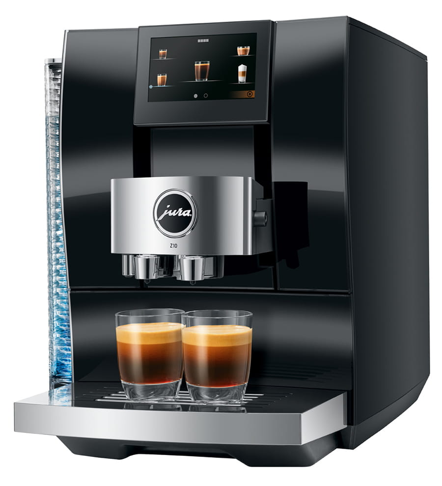
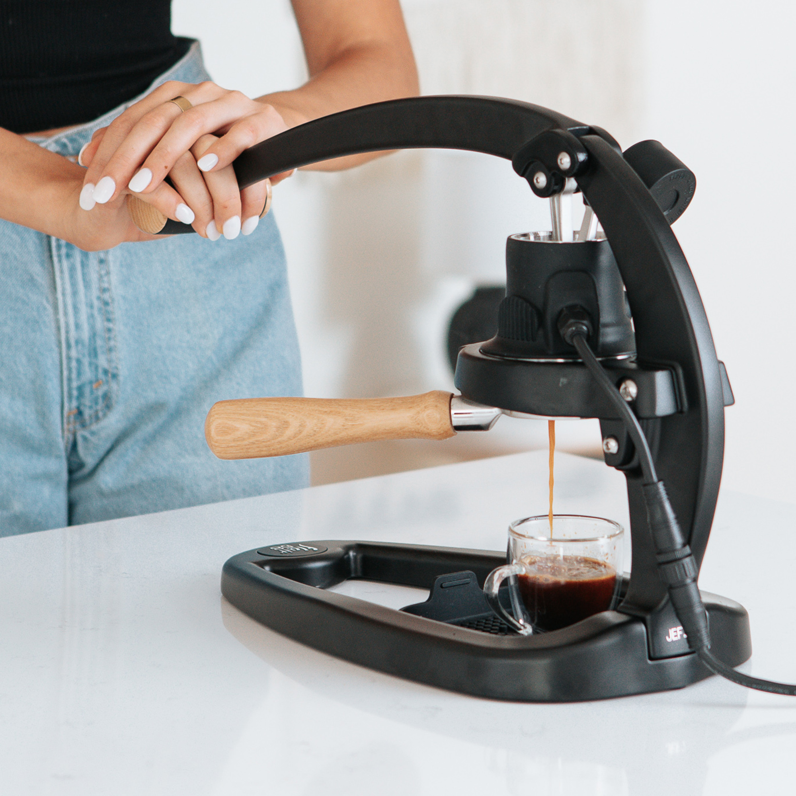
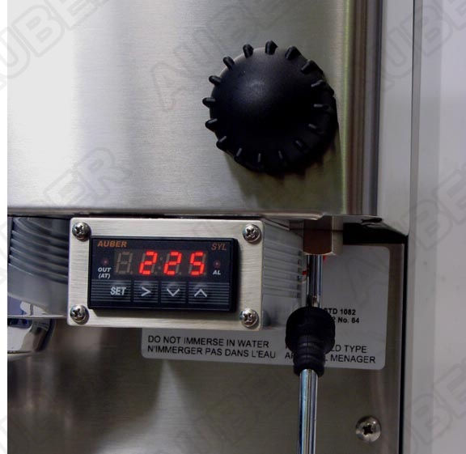
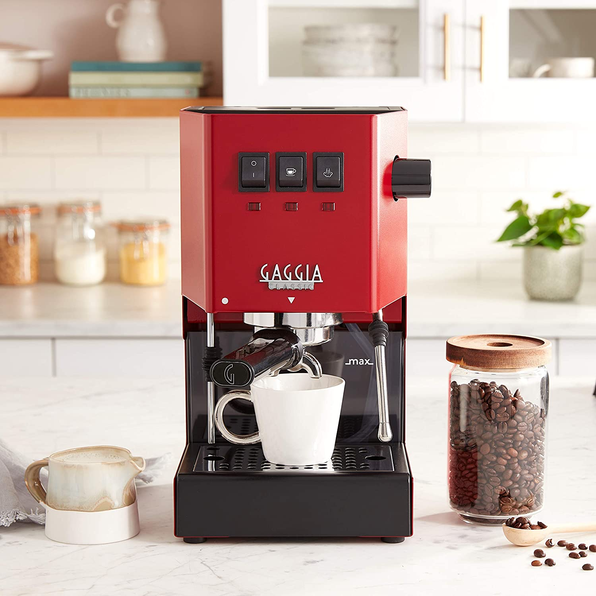
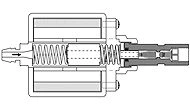
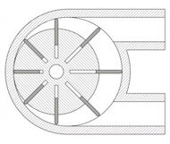
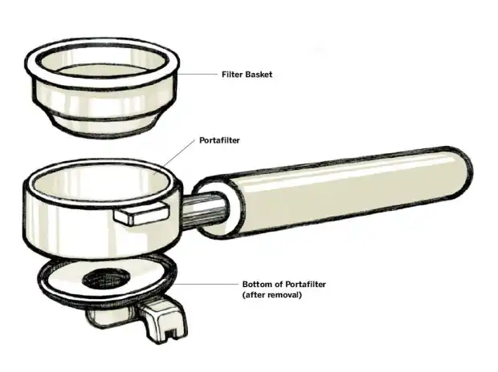
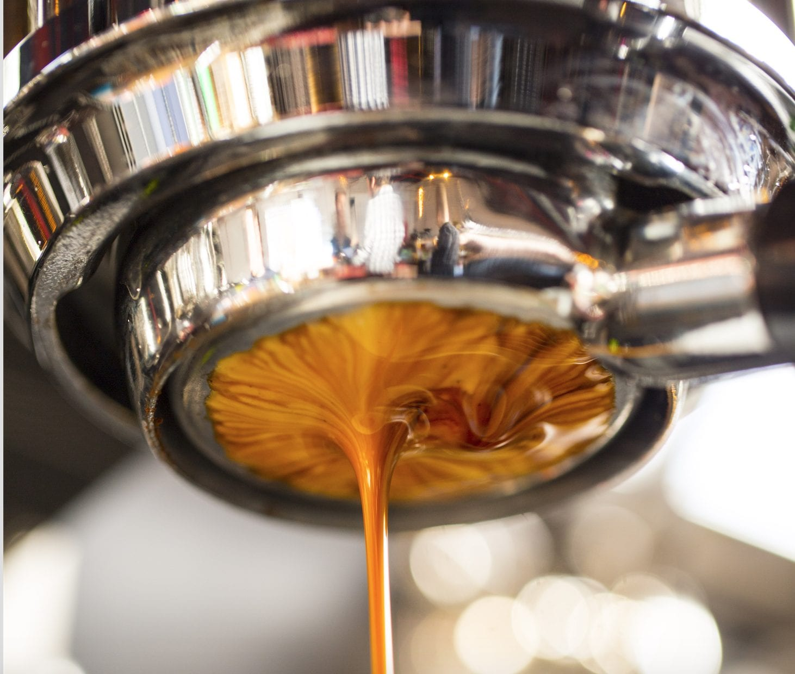

## Introduction

### Just Don't Do It

If you’re wondering if you should get an espresso machine, just don’t. Making quality espresso at home is so much more difficult than drip coffee. You’re going to have to deep-dive into super coffee nerd-dom if you hope to replicate anything close to the quality you can get at your local (third wave) coffee shop.

If you don’t plan on investing a ton of time and money into this newfound hobby, either settle for a fully automatic espresso machine, which won’t make great coffee, or stick to buying cappuccinos at your local coffee shop while making drip coffee at home. Trust me.

However, if you’re ready to embark on this journey, it can be incredibly fun and rewarding. Only take this step if you know what you’ll be getting yourself (and your wallet) into. If you’re up for the challenge, read on!

## Types of Espresso Machines

### Super Automatic

These are the types of machines you’ll find at hotel amenity lounges or in airports. They will grind the beans, brew the coffee, froth the milk, and present you with a finished cup of coffee all at the press of a button. These machines are incredibly easy to use, but the quality of coffee out of them is mediocre, to put it mildly. If you just want your caffeine-fix and want to be super fancy without having to learn anything about espresso, get one of these.

These machines are all extremely expensive and not as fun to use. James Hoffman, my favorite coffee YouTuber, did a review recently about the best fully automatic espresso machines. You can watch that [here](https://youtu.be/iZEM1cC86t8). The TL;DW is that he recommended the [Jura Z10](https://www.amazon.com/Jura-15361-Z10-Aluminum-White/dp/B095J6NKPK/), which costs almost $4000.

_Jura Z10 [(Image Credit Jura USA)](https://us.jura.com/en/homeproducts/machines/Z10-Diamond-Black-NAA-15464)_

### Semi Automatic

This is really the sweet spot of espresso machines. Most of the machines you’ll find at your local coffee shop will be a commercial semi auto. Unlike fully automatic machines, you will have to grind and foam the milk yourself. But unlike fully manual machines, these include an electric pump to generate the pressure for extracting the espresso as well as a steam wand for frothing your milk.

These are by far the most common types of espresso machines, and as such, offer the most variety in options and price.

The rest of the guide explores options for semi auto machines.

### Manual

These are the “old school” style of espresso machines, before electricity was introduced to generate the 9 bars of pressure required to extract espresso. They involve some type of lever that you have to manually pull to generate enough pressure to extract the espresso. However, there has been a resurgence of newer and fancier fully manual machines for espresso enthusiasts who really know what they’re doing and want full control over every part of the express-making process. However, if you’re reading this guide it’s more than likely that’s not you. I would strongly advise against getting a fully manual machine as your first espresso machine.

There are some really cool options in this category though, the [Flair 58](https://flairespresso.com/product/flair-58/), for example.

_Flair 58 [(Image Credit Flair Espresso)](https://flairespresso.com/)_

## Types of Boilers

### Introduction

Your choice of boiler will ultimately come down to three choices: power, precision, and price. Power is the power of a machine’s heating elements and the capacity of its boilers. More power means more shots pulled in a row and/or faster steaming of milk. Machines with larger boiler capacity will have more power. When you are looking at the spec sheet of espresso machines, boiler capacity is indicated in liters.

Precision almost always comes in the form of temperature control. Pulling your shots at the right temperature makes all the difference in the world. A machine that can produce hot water at a super consistent temperature will allow you to pull the same delicious shot time after time.

When you’re brewing coffees of different roast levels, the ability to customize the shot temperate makes a huge difference. Light roasts taste so much better at higher temps and darker roasts definitely prefer a lower temp. You can’t brew every type of coffee at the same temperature and expect consistently amazing results.

### But First, A Note on PIDs

More expensive espresso machines, and almost all dual boilers, come equipped with a PID (Proportional Integral Derivative) to control the temperature. PIDs use advanced algorithms to regulate the temperature so that it stays exactly at the degree you set it to.

_An after-market PID added to a Rancilio Silvia_

As mentioned above, temperature control is one of the most important factors in ensuring you consistently create great espresso and are able to more easily get great results from a variety of different roast levels. On single boiler machines, PIDs can make it much easier to get consistency from your shots.

### Single Boiler

Single Boiler espresso machines use, as the name suggests, a single boiler for both brewing espresso and steaming milk. These machines are often compact and cheaper than other semi auto options.

Major downsides with single boilers are that you cannot brew espresso and steam milk at the same time. You either will have to brew your espresso first, then wait for the machine to heat up to steam temp before frothing your milk or froth your milk first then wait for the machine to cool down before brewing espresso. The difference in temperature required for brewing and steaming can be as much as 40º F.

If your machine doesn’t have a PID, you will have to guess when your water is at the correct temperature. You can do this using a technique known as [temperature surfing](https://youtu.be/KTRKpao-5Z0). This is where you fiddle with the machine by doing things like purging the group head, waiting between brews, etc., to ensure the machine gets up to the right temperature. This is quite an annoying and inaccurate process.

_Gaggia Classic Pro_

Some of the most popular single boiler machines are the [Gaggia Classic Pro](https://www.amazon.com/Gaggia-RI9380-46-Espresso-Stainless/dp/B07RQ3NL76?th=1), [Rancilio Silvia](https://www.seattlecoffeegear.com/shop-gear/espresso-machines/rancilio-silvia-espresso-machine), and the [Lelit Anna](https://prima-coffee.com/equipment/lelit/pl41em-lelit-sp).

### Heat Exchanger (HX)

Heat Exchangers are a completely different technology to single boilers. Whereas a standard single boiler pulls water directly from the boiler to both steam and brew, heat exchangers separate this process. In heat exchanger machines, the water in the boiler is kept at a high enough temperature to create steam, often 255º - 265º F. When you pull a shot, water is pulled from the reservoir via a copper pipe that runs from the reservoir through the boiler to the group head. These tubes are designed to pull heat out of the boiler just enough to guarantee that the water that enters the group head to brew your espresso is at the perfect temperature. Meanwhile, steam is pulled directly from the boiler, allowing you to brew and steam at the same time.

These machines are often more affordable than dual boiler machines because there’s a lot less material that goes into them. However, the trade off is consistency and finer temperature control. Often heat exchangers that come with a PID only let you control one temperature, for example the steam boiler temperature, and then you have to do the math to figure out how that translates to brew temp. Additionally, if you make a lot of coffees in a short time it’s possible to outrun them, meaning there’s no more hot water left in the boiler and you’ll have to wait another 10-20 minutes for more water to heat up.

Some of the most popular HX machines are the [Profitec Pro 500](https://clivecoffee.com/products/profitec-pro-500-pid-espresso-machine), [Rocket Appartamento](https://www.seattlecoffeegear.com/rocket-espresso-appartamento-espresso-machine), and the [Lelit Mara X](https://www.chriscoffee.com/products/lelit-mara-x).

### Dual Boiler

These are the best, and most expensive, home espresso boilers you can get. These machines have two separate boilers - one for brewing and one for steaming. This allows each boiler to always be ready for either task. These machines offer much better consistency for temperature because you don’t have to constantly heat up and cool down when switching between brewing and steaming. It’s also almost impossible to outrun brew boiler recovery on these machines.

The major downside with dual boilers is cost. These machines are often larger than single boilers and heat exchangers as well, which requires a larger counter space.

Some of the most popular Dual Boilers are the [Breville Dual Boiler](https://www.amazon.com/Breville-BES920BSXL-Boiler-Espresso-Machine/dp/B00ISQ6ZM0), [Rancilio Silvia Pro X](https://www.wholelattelove.com/products/rancilio-silvia-pro-x-dual-boiler-espresso-machine), and the [Lelit Bianca](https://clivecoffee.com/products/lelit-bianca-dual-boiler-espresso-machine).

### Thermoblocks & Thermocoils

#### Thermoblocks

Thermoblocks are blocks of metal with integrated heating elements. As water is needed for brewing or steaming, water travels the heated block of metal and heats up as it passes through. The water is in contact with the thermoblock for only a short time, but in that time it can flash heat to temperatures high enough for espresso and steaming. By altering the flow rate through the block, temperatures for each application can be met.

Major benefits of thermoblock machines are that they take significantly less time to heat, they’re more energy efficient and have better temperature control than single boiler machines.

However, they do have some major disadvantages. Thermoblocks are two pieces of metal, which can be prone to leaking. A crack in the block can affect water temperatures. This leads these types of machines to be less durable over time. Thermoblocks also lead to less consistent temperatures compared to dual boilers or Heat Exchangers with PIDs. They’re also prone to scaling, which requires constant maintenance and cleaning.

Some of the most popular Thermoblock machines are the [Ascaso Dream Machine](https://www.amazon.com/Ascaso-Programmable-Espresso-Volumetric-Controls/dp/B08JCWD9G3), and the [Ascaco Steel PID](https://www.amazon.com/Ascaso-Programmable-Espresso-Volumetric-Thermoblock/dp/B08KYQW32V).

#### Thermocoils

Similar to Thermoblocks, this is a newer technology. It also heats water up on demand for brewing and steaming. The main difference, however, is that a thermocoil uses a single tube instead of a multi-piece block of metal. The tubes are typically made out of copper and other metals. Only small amounts of water pass through the tubes at any given second, allowing the water to be evenly exposed to the heating element. Because of the more thorough circular movement of the water in the chamber, the water is generally more consistent in temperature compared to Thermoblocks. Thermocoils are also generally more durable than Thermoblocks.

Thermoblocks have more consistent temperatures and durability than Thermoblocks. However, they are also very prone to scaling. They are prone to losing heat pretty quickly. After one shot is pulled, the thermocoil needs time to re-heat for another round of espresso and steaming. This is not something you’d experience with traditional boilers machines that heat a larger amount of water at start, and then keeps the water at temp for longer.

Some of the most popular Thermocoil machines are the [Breville Bambino Plus](https://www.amazon.com/Breville-BES500BSS-Bambino-Espresso-Stainless/dp/B07JVD78TT/) and the [Decent DE1PRO](https://decentespresso.com/de1pro).

## Types of Pumps

### Introduction

To give water the strength needed to push through a tightly packed bed of finely ground coffee, espresso machines need around 9 bars of pressure, which roughly translates to 130 psi. Some of the first espresso machines used pistons attached to large levers to achieve these pressures. Baristas would have to manually pull these levers to force the water to pass through the coffee. Semi automatic machines are called such because the process of creating this pressure is automated.

There are two categories of electric pump: the vibratory pump and the rotary vane pump.

### Vibration Pump

These are the most common, and the cheaper option. A piston attached to a magnet is set inside a metal coil. Electrical current runs through the coil causing the magnet to rapidly move the piston back and forth, pushing water through the machine. Your average vibe pump clocks in at sixty pushes per second.

Benefits of this option is that they’re much smaller, resulting in a smaller espresso machine that requires less counter space. They also often ramp up to pressure more slowly, which some people actually prefer. That results in a short period of lower-pressure pre-infusion prior to reaching full brewing pressure. This isn’t controllable, but can help reduce channeling.

Downsides of vibration pumps is that they’re much louder and most machines with vibration pumps are not plumable into your kitchen’s water line.

_Vibratory Pump Diagram [(Image credit Clive Coffee)](https://clivecoffee.com/blogs/learn/how-do-espresso-machines-work)_

Benefits of this option is that they’re much smaller, resulting in a smaller espresso machine that requires less counter space. They also often ramp up to pressure more slowly, which some people actually prefer. That results in a short period of lower-pressure pre-infusion prior to reaching full brewing pressure. This isn’t controllable, but can help reduce channeling.

Downsides of vibration pumps is that they’re much louder and most machines with vibration pumps are not plumable into your kitchen’s water line.

### Rotary Pump

Unlike a vibratory pump, a rotary pump is mechanical. A motor spins a disc that is offset inside a large, round chamber. The spinning disc is segmented into sections by vanes. As the disc spins, the vanes press against the wall of the outer chamber, diminishing the size of the section, creating pressure. Water enters during the large phase and is pushed out as the section shrinks.

_Rotary Pump Diagram [(Image credit Clive Coffee)](https://clivecoffee.com/blogs/learn/how-do-espresso-machines-work)_

Rotary pumps are considered commercial grade, and as such, are more expensive and less common. However, they’re much quieter than vibration pumps and offer more consistent pressure.

## Group Heads

### Introduction

#### E 61 Style

This is the traditional group head style, named after the Faema E61 espresso machine, which itself was named for the solar eclipse the year it was introduced, 1961.

#### Ring Style

---

## Portafilters

### Introduction

The Portafilter is the handle you plug into your espresso machine that contains the puck of coffee.

_Portafilter Diagram [(Image Credit Makezine)](https://makezine.com/projects/the-bottomless-portafilter/)_

Portafilters are traditionally made up of three distinct parts: The filter basket, the portafilter itself, and the bottom of the portafilter.

### Filter Baskets

#### Pressurized Filter Baskets

Pressurized portafilter baskets will never make as good espresso as regular ones, but are intended for people who buy pre-ground coffee. These work by using an internal screen that filters the coffee into a small holding area with a tiny hole in the bottom. The espresso collects in the holding area until the pressure builds enough to force it out of the small hole. Pressurized portafilter baskets are more forgiving because they don’t suffer from channeling if your grind size isn’t great. Downsides of the pressurized basket is that the “crema” of the espresso is fake and not the result of fine espresso extraction and the final result doesn’t taste as good.

Breville and DeLonghi machines often exclusively come with pressurized portafilter baskets. Keep this in mind as you’ll most likely need to upgrade your filter basket if you choose one of these machines.

#### Regular Filter Baskets

Unlike pressurized baskets, there is no internal screen separating the coffee from the bottom of the basket, just a lot of small holes. As pressure builds on the coffee puck, water exits out of these small holes. If your grind size is not consistent, you can experience channeling, which will lead to a pull that is too fast and won’t taste great.

The filter baskets that come with most espresso machines are not the highest quality and you’ll find yourself wanting to upgrade. This is something to keep in mind when choosing an espresso machine - the quality of the included filter basket.

### Portafilter Size

The most common size of portafilters is 58mm. You’ll find the most widely available accessories for this portafilter size, i.e. tampers, distributor tools, replacement baskets, etc. If you invest in a machine with a 54mm portafilter and plan to upgrade in the future you won’t be able to re-use any of the 54mm accessories you bought.

#### Bottomless Portafilters

Almost all portafilters that come with your espresso machine will have a bottom. Many people choose to buy an aftermarket bottomless portafilter for a number of reasons. First of all, you can easily see if you have any channeling, which means you had poor puck preparation. Channeling will mean your espresso is not extracting optimally. Additionally, bottomless portafilters just look cool!

However, two downsides of naked portafilters are that they are definitely more messy than portafilters with bottoms. Also, you can’t pull your espresso into two espresso cups at the same time.

Regardless, this is a great accessory to buy as you’re learning how to make espresso to double-check your puck preparation. Something to keep in mind as you choose your espresso machine is the availability of bottomless portafilters for your machine.

_Bottomless portafilter [(Image Credit Perfect Daily Grind)](https://perfectdailygrind.com/2016/02/whats-the-deal-with-bottomless-portafilters-3-must-see-videos/)_
